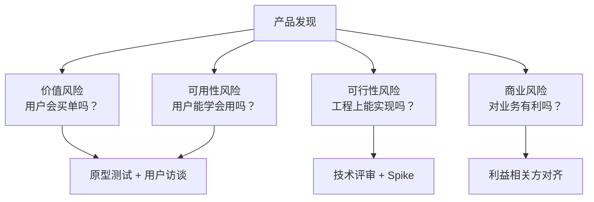
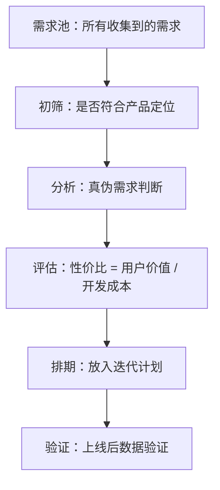
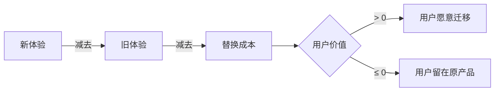
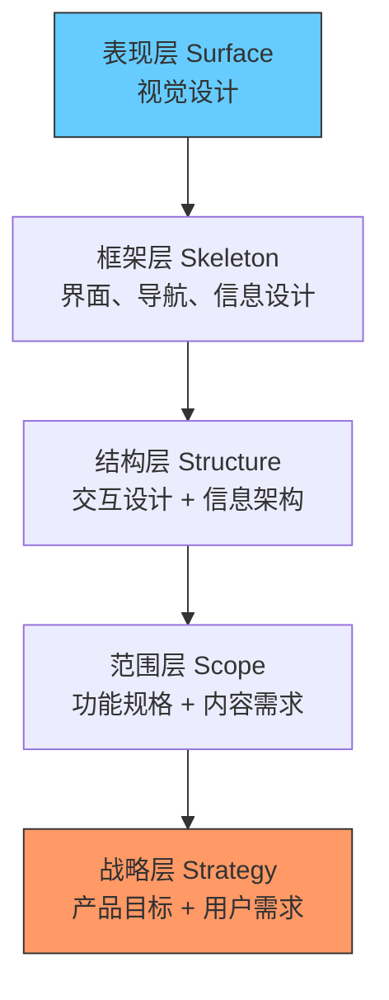
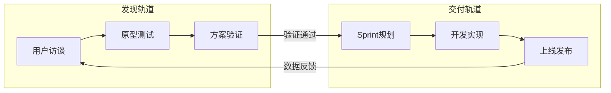
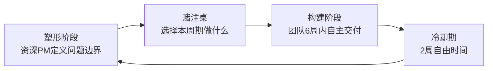
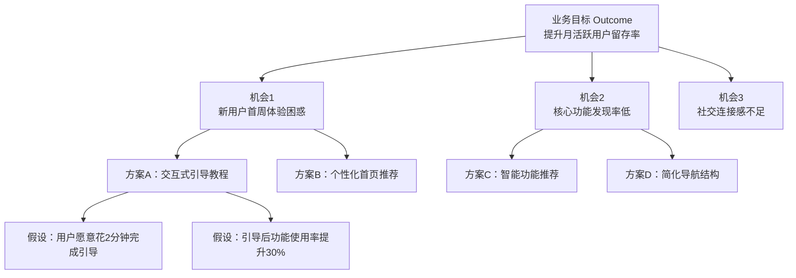
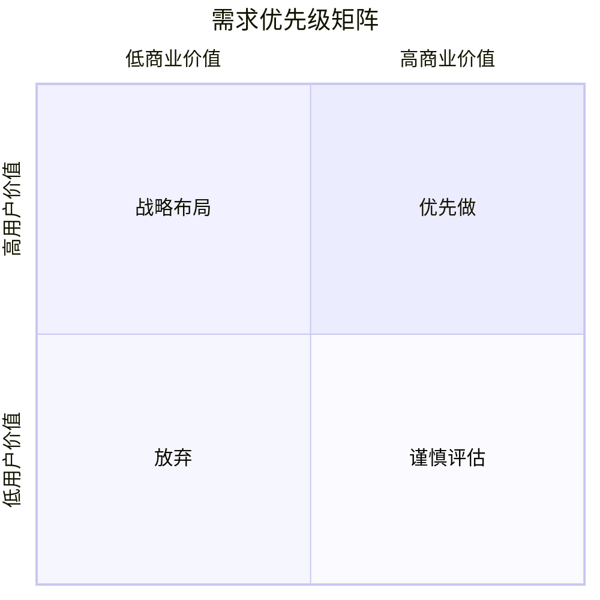
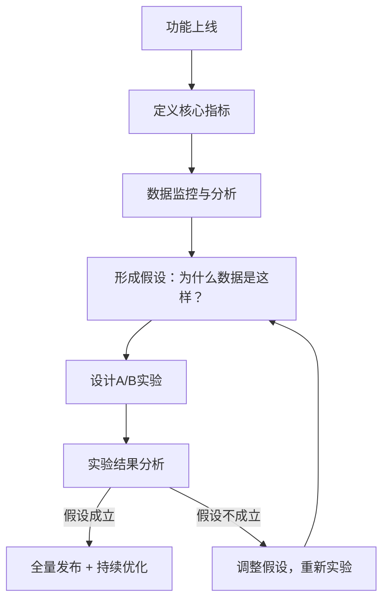
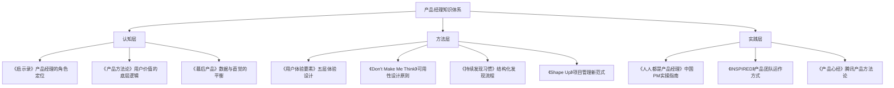

# 产品思维与方法论

> 产品经理的基本功：如何定义产品、发现需求、验证假设。

---

## 《启示录：打造用户喜爱的产品》

**作者**：Marty Cagan | **评分**：⭐⭐⭐⭐⭐ | **难度**：入门

### 一句话总结
产品经理的角色不是需求文档的翻译机器，而是**发现值得做的产品**的人。

### 核心精华

- **产品发现（Product Discovery）是核心职责**：产品经理最重要的工作不是写PRD，而是在开发之前就回答清楚四个关键问题——用户会买吗（价值性）？用户会用吗（可用性）？我们能做出来吗（可行性）？利益相关方支持吗（商业可行性）？很多团队跳过发现阶段直接进入交付，导致做出了没人要的产品。
- **产品经理 ≠ 项目经理**：Cagan反复强调，产品经理要对产品的"价值"和"可用性"负责，而非仅仅推动进度。如果你每天80%的时间在开会、追进度、写文档，那你可能在做项目经理的活。真正的产品经理应该花大量时间与用户交流、分析数据、评估机会。
- **评估产品机会的十大问题**：在决定是否启动一个项目之前，必须回答：1)这个产品解决什么问题？2)目标用户是谁？3)成功的标准是什么？4)市场规模如何？5)竞品格局怎样？6)为什么现在做？7)市场进入策略是什么？8)解决方案是什么？9)关键风险在哪里？10)凭什么是我们做？这套框架至今仍是产品立项的黄金标准。
- **最小可行产品（MVP）的正确理解**：MVP不是做一个"烂版本"先上线，而是用最小代价验证最大风险。Cagan建议使用高保真原型来快速获取用户反馈，而不是真正写代码。一个好的MVP可能只是一个可交互的Figma原型配合用户访谈。
- **原型测试胜过一切假设**：与其花三个月开发再上线验证，不如花一周做出原型让十个目标用户试用。用户在真实场景中的行为远比问卷调查和头脑风暴可靠。Cagan推荐每周至少进行一次用户原型测试。
- **产品委员会是创新的坟墓**：当产品方向由一群高管投票决定时，往往选出的是最安全、最无聊的方案。Cagan主张给产品团队赋权，让最了解用户和技术的人做决策。
- **工程师是最被浪费的创新资源**：大多数公司把工程师当成"写代码的人"，但优秀的工程师往往能提出最具创新性的解决方案。产品经理应该让工程师参与到问题定义阶段，而不是只给他们一个已经确定的需求列表。

### 关键模型/框架

**产品发现四风险模型：**



**机会评估框架：** 每个产品机会都应该通过"十大问题"模板进行系统评估，只有通过评估的机会才值得进入产品路线图。

### 产品经理实战启示

1. **每周安排用户测试时间**：不要等到版本快上线才做测试，把用户访谈和原型测试变成每周固定动作，持续获取反馈。
2. **用"机会评估"替代"需求收集"**：老板说"我们要做个XX功能"的时候，不要直接写需求，先用十大问题模板评估这个机会是否值得投入。
3. **拉工程师一起见用户**：让工程师直接听到用户的痛苦和困惑，他们会自发地想到更好的解决方案。
4. **区分"产品发现"和"产品交付"**：这是两个完全不同的阶段，发现阶段追求速度和学习，交付阶段追求质量和可靠。不要混为一谈。

### 经典语录

> "产品经理的工作不是定义产品的外观和行为，而是发现一个有价值的、可用的、可行的产品。"

> "如果你只是把销售和客户的需求做成功能列表，那你只是一个需求管理员，不是产品经理。"

> "你的工作是传教士，不是雇佣兵。传教士真心相信产品的愿景，雇佣兵只是在完成任务。"

---

## 《人人都是产品经理》

**作者**：苏杰 | **评分**：⭐⭐⭐⭐ | **难度**：入门

### 一句话总结
每个人都可以用产品经理的思维方式来思考和解决问题，产品经理的核心能力是**在正确的时间做正确的事**。

### 核心精华

- **需求采集的"四象限"法则**：需求来源可以分为内部/外部、主动/被动四个象限。外部主动需求（如用户反馈）最直接，但不一定最重要；内部主动需求（如数据分析发现的洞察）往往最有价值。好的产品经理不是被动等需求，而是主动去挖掘。
- **需求分析的三层模型**：表面需求（用户说的话）→ 真实需求（用户实际的问题）→ 底层需求（人性层面的动机）。经典案例：用户说"我要一匹更快的马"，真实需求是"更快到达目的地"，底层需求是"节省时间/提高效率"。产品经理要学会穿透表面看本质。
- **项目管理是产品经理的基本功**：在中国互联网环境中，产品经理往往要兼任项目管理的角色。苏杰强调了排期、跟进、协调资源、管理风险这些"脏活累活"的重要性。不会管项目的产品经理，再好的想法也落不了地。
- **需求优先级的KANO模型应用**：将需求分为基本型、期望型、兴奋型三类。基本型需求（如App不闪退）做不好会扣分但做好不加分；期望型需求（如搜索速度快）与满意度线性相关；兴奋型需求（如意想不到的贴心功能）能带来惊喜。资源有限时优先保证基本型，再追求兴奋型。
- **产品经理的"T型能力"模型**：横向要广泛了解技术、设计、运营、市场等各领域知识，纵向要在某个方向有深度。苏杰建议初入行的产品经理先花1-2年横向拓展视野，然后选择一个方向深耕。
- **中国互联网PM的特殊语境**：不同于硅谷PM更多是"小CEO"，国内PM往往要面对更复杂的组织关系——要搞定领导、协调跨部门资源、处理内部政治。书中大量案例来自阿里巴巴实战经验，对理解中国PM工作环境非常有价值。
- **用户故事和用例的实操写法**：书中提供了大量模板和实例，手把手教你如何写用户故事（作为XX用户，我希望XX，以便XX）、如何画用例图、如何写PRD。对于刚入行的PM极其实用。

### 关键模型/框架

**需求采集四象限：**

| | 主动 | 被动 |
|---|---|---|
| **外部** | 用户调研、问卷、可用性测试 | 客服反馈、用户投诉、论坛 |
| **内部** | 数据分析、竞品研究、头脑风暴 | 老板需求、销售反馈、业务方诉求 |

**需求筛选漏斗：**



### 产品经理实战启示

1. **建立个人需求池**：用Notion或飞书文档维护一个需求池，随时记录来自各渠道的需求，每周花1小时进行清理和优先级排序。
2. **学会"向上管理"**：老板提出的需求不要直接拒绝，也不要照单全收。用数据和用户反馈来论证你的优先级判断，同时给出替代方案。
3. **先做减法，再做加法**：新人产品经理容易犯的错误是什么都想做。先砍掉80%的需求，聚焦最核心的20%，做到极致。
4. **重视"非功能需求"**：性能、安全、兼容性这些看不见的需求，往往决定了产品的下限。别只盯着炫酷的新功能。
5. **用"一页纸产品文档"取代长篇PRD**：对于早期验证阶段，一页纸就够了——问题描述、目标用户、核心场景、成功指标。

### 经典语录

> "产品经理是一类人，他的做事思路和方法可以解决很多实际的生活问题，只要你能够发现问题并描述清楚，转化为一个需求，进而转化为一个任务，争取到资源，推动它完成，你就是产品经理。"

> "需求不是想出来的，是从大量的事实中分析出来的。"

> "先有用，再好用，再爱用。"

---

## 《产品方法论》

**作者**：俞军 | **评分**：⭐⭐⭐⭐⭐ | **难度**：进阶

### 一句话总结
产品的本质是**交易**，用户选择你的产品是因为你提供的效用大于他付出的成本，即**用户价值 = 新体验 - 旧体验 - 替换成本**。

### 核心精华

- **用户价值公式：新体验 - 旧体验 - 替换成本**：这是全书最核心的公式。用户不会因为你的产品"好"就迁移过来，而是因为你的产品比他现在用的好**足够多**，多到能覆盖他切换的心理成本、学习成本和数据迁移成本。这解释了为什么很多"更好的产品"打不过在位者——旧体验已经足够好了，替换成本太高了。
- **效用模型（Utility）的深度应用**：俞军引入经济学中的效用理论来分析产品决策。一个功能的价值不是绝对的，而是边际的——用户已有10个表情包时，再多一个的价值远低于只有1个时新增1个。产品经理要时刻考虑用户的边际效用递减。
- **产品感觉（Product Sense）的培养**：俞军认为产品感觉不是天赋，而是通过大量案例积累形成的"快速模式匹配"能力。就像围棋棋感来自上千局对弈，产品感觉来自对上千个产品案例的深度分析。他建议每个PM至少深度使用和分析100款产品。
- **用户不是"人"，而是需求的集合**：同一个人在不同场景下是不同的"用户"。一个人早上是"通勤用户"，中午是"点餐用户"，晚上是"娱乐用户"。不要试图服务"一个人的所有需求"，而要聚焦"一个场景下的核心需求"。
- **交易模型看产品**：每次用户使用产品，都是一次交易。用户付出时间、注意力、金钱，换取产品提供的效用。如果这个交易不划算（效用 < 成本），用户就会离开。产品经理要时刻审视这个交易是否对用户公平。
- **选择能力大于执行能力**：俞军在百度搜索的经验让他深刻认识到，做什么比怎么做更重要。一个平庸执行的正确方向，远胜过一个完美执行的错误方向。产品经理的核心价值在于选择——选择做什么，不做什么。
- **数据驱动的陷阱**：俞军警告不要盲目迷信数据。数据告诉你"是什么"，但不告诉你"为什么"。短期数据可能误导长期决策，局部最优可能导致全局灾难。要在数据理性和用户直觉之间找到平衡。

### 关键模型/框架

**用户价值公式：**



**产品竞争策略矩阵：**

| 策略 | 方法 | 案例 |
|---|---|---|
| 提升新体验 | 10倍好的产品创新 | iPhone替代诺基亚 |
| 降低旧体验 | 等待在位者犯错 | 微信趁运营商短信体验差时崛起 |
| 降低替换成本 | 一键导入、免费迁移 | WPS兼容Office格式 |

### 产品经理实战启示

1. **做竞品分析时用"价值公式"思考**：不要只比功能多少，而要计算你和竞品之间的体验差值是否大于用户的替换成本。如果差值不够大，就需要找到降低替换成本的策略。
2. **警惕"创新者窘境"**：在位产品有巨大的替换成本优势。颠覆者往往不是正面打败在位者，而是从在位者看不上的边缘市场切入。
3. **培养产品感觉的方法**：每周深度分析2-3款产品，写下"为什么这个功能这样设计"，坚持一年你的产品感觉会有质的飞跃。
4. **用"交易思维"审视每个功能**：每加一个功能，问问用户在这个交易中付出了什么（学习成本、认知负担、操作步骤），得到了什么。如果交易不划算，这个功能不该做。

### 经典语录

> "用户价值 = 新体验 - 旧体验 - 替换成本。"

> "产品经理就是以创造用户价值为工具，打破旧的利益平衡，建立对己方有利的新利益链，建立新平衡的过程。"

> "好的产品经理一定是一个好的经济学思考者。"

---

## 《用户体验要素》

**作者**：Jesse James Garrett | **评分**：⭐⭐⭐⭐⭐ | **难度**：入门

### 一句话总结
用户体验不是视觉设计，而是从**战略层到表现层**五个层面的系统化设计过程。

### 核心精华

- **五层模型（由抽象到具体）**：战略层（Strategy）→ 范围层（Scope）→ 结构层（Structure）→ 框架层（Skeleton）→ 表现层（Surface）。这五层自下而上依次构建，每一层的决策都约束上一层的可能性。产品经理必须自下而上思考，不能跳过战略层直接设计界面。
- **战略层：产品目标与用户需求的交汇**：这是一切的起点。你需要回答两个问题——我们要从这个产品中得到什么（商业目标）？用户要从这个产品中得到什么（用户需求）？只有两者的交集才是正确的产品方向。很多产品失败都是因为战略层就错了。
- **范围层：功能规格与内容需求**：在明确战略之后，定义具体要做什么和不做什么。这一层需要输出功能清单和内容规划。关键在于"不做什么"——范围的边界定义比范围本身更重要。
- **结构层：交互设计与信息架构**：定义用户如何与产品交互（交互设计）以及信息如何组织和分类（信息架构）。这一层决定了用户能否"找到"他们需要的东西。好的信息架构让用户无需思考就能导航。
- **框架层：界面设计、导航设计、信息设计**：将结构层的抽象概念转化为具体的界面元素——按钮放在哪里、导航如何呈现、信息如何排布。这一层是用户体验最"看得见摸得着"的部分。
- **表现层：视觉设计**：色彩、排版、图片、动效。这是用户最先感知到的层面，但也是最表面的层面。如果底层设计有问题，再漂亮的视觉也救不了糟糕的体验。
- **自下而上的设计流程**：Garrett强调，好的设计必须从战略层开始，逐层向上推进。如果你先画了一个漂亮的界面再去想功能和战略，最终一定会返工。这就是"战略先行"的核心思想。

### 关键模型/框架

**用户体验五层模型：**



### 产品经理实战启示

1. **每次需求评审前，先对齐战略层**：在讨论具体功能之前，先花5分钟确认"这个功能服务于什么商业目标和用户需求"。如果说不清楚，这个需求可能不该做。
2. **用五层模型做竞品分析**：不要只对比表现层（谁更好看），而要逐层分析战略定位、功能范围、信息架构、交互设计的差异。
3. **设计评审时分层讨论**：不要在一个会议上同时讨论战略方向和按钮颜色。分层讨论能大幅提高评审效率。
4. **向上游追溯问题根源**：如果表现层有问题（用户觉得界面混乱），往往根源在结构层（信息架构有问题）甚至更深的战略层。

### 经典语录

> "用户体验设计通常要解决的是应用环境的综合问题。"

> "战略层的错误会逐层放大，到表现层时可能已经无法挽回。"

> "好的用户体验不是在产品做完后'加上去'的，而是从一开始就设计进去的。"

---

## 《Don't Make Me Think》

**作者**：Steve Krug | **评分**：⭐⭐⭐⭐⭐ | **难度**：入门

### 一句话总结
可用性的第一法则：**别让用户思考**。每一个让用户犹豫的元素都是在消耗他们有限的耐心。

### 核心精华

- **Krug第一定律：别让我思考**：用户在使用产品时不应该产生任何疑问——"这是什么？""我该点哪里？""这个按钮是什么意思？"每一个需要思考的瞬间都在增加用户放弃的概率。好的设计是自解释的，不需要说明书。
- **Krug第二定律：点击次数不重要，思考次数才重要**：用户不在乎多点几次，只要每次点击都是无需思考的、明确的选择。三次无脑点击远好于一次犹豫不决的点击。不要为了减少点击次数而把复杂选项塞在同一页面。
- **Krug第三定律：去掉每页一半的文字，然后再去掉剩下的一半**：用户不阅读，用户扫描。网页上的文字越少，剩下的文字越可能被看到。每一段文字都要反问自己——如果删掉它，用户会受影响吗？
- **主干测试（Trunk Test）**：打开网站的任意一页，你应该能立即回答：我在哪个网站？我在哪个页面？主要导航在哪里？我在当前层级的什么位置？我怎么搜索？这个测试是检验网站可用性的快速方法。如果回答不了，说明导航系统有问题。
- **用户不会做最优选择，只会做"足够好"的选择**：Herbert Simon的"满意即可"原则在产品设计中体现得淋漓尽致。用户不会仔细比较所有选项再做决定，而是看到第一个差不多的选项就点击了。所以最重要的选项要放在最显眼的位置。
- **可用性测试不需要很多人**：Krug打破了"可用性测试需要大量用户"的误区。他认为5个用户就能发现大部分问题，甚至3个用户测试也比没有强百倍。关键是持续做，每月做一次轻量级测试远好于一年做一次大型测试。
- **首页的重要性被高估了**：很多团队花大量时间争论首页设计，但实际上大部分用户通过搜索引擎直接进入深层页面。与其花80%精力优化首页，不如确保每个页面的可用性都达标。

### 关键模型/框架

**主干测试（Trunk Test）清单：**

```
在任意页面，用户应能在5秒内回答：
┌────────────────────────────┐
│ 1. 这是什么网站/产品？       │
│ 2. 我现在在哪个页面？        │
│ 3. 主导航在哪里？           │
│ 4. 我在层级结构中的位置？     │
│ 5. 我如何进行搜索？         │
│ 6. 如何回到首页？           │
└────────────────────────────┘
→ 如果有任何一项答不上来，导航需要优化。
```

### 产品经理实战启示

1. **每月做一次"咖啡馆测试"**：找3-5个非目标用户（甚至路人），给他们看你的产品，观察他们的第一反应和操作路径。不需要专业实验室，咖啡馆就够了。
2. **对每个页面做主干测试**：随机截取产品中的10个页面，用主干测试检验。凡是不能在5秒内回答全部问题的页面，都需要优化。
3. **删文字是最有效的优化手段**：下次改版时，不要想"加什么"，先想"删什么"。删掉50%的文字、说明、提示，看看用户是否真的需要它们。
4. **按钮文案比按钮颜色重要100倍**：用户犹豫不点某个按钮，90%的原因是文案不清楚，而不是颜色不够醒目。"立即开始"比"提交"好，"免费试用30天"比"注册"好。

### 经典语录

> "别让我思考！（Don't Make Me Think!）"

> "用户的实际行为是'满意即止'——看到一个差不多的选项就会点击，而不是寻找最优解。"

> "如果某个东西需要一个标签或说明才能让人理解，那它就是需要重新设计的。"

---

## 《INSPIRED：如何打造用户喜爱的科技产品》

**作者**：Marty Cagan | **评分**：⭐⭐⭐⭐⭐ | **难度**：中级

### 一句话总结
真正的产品团队是**被赋予问题而非功能**的团队，他们通过持续发现来找到客户喜爱且对业务有效的解决方案。

### 核心精华

- **产品团队 vs 功能团队**：功能团队是"路线图驱动"的，接收需求清单然后执行。产品团队是"目标驱动"的，被赋予一个业务问题或目标，自主决定最好的解决方案。前者是"雇佣兵"，后者是"传教士"。Cagan认为只有产品团队模式才能持续创新。
- **持续发现（Continuous Discovery）**：产品发现不是一个"阶段"，而是与产品交付并行进行的持续活动。每周至少3小时用于发现工作——用户访谈、原型测试、数据分析。发现和交付是双轨并行的，不是先做完发现再做交付。
- **产品发现的四大技巧**：机会评估（这值得做吗？）、客户访谈（用户真正需要什么？）、原型测试（解决方案有效吗？）、数据验证（上线后效果如何？）。这四个技巧形成一个闭环，确保产品决策有足够的依据。
- **产品愿景和产品策略**：产品愿景描述的是2-5年后你希望达到的状态，产品策略是实现愿景的路径。愿景激励团队，策略指导行动。没有愿景的团队只会做短期优化，没有策略的愿景只是空想。
- **OKR在产品团队中的应用**：Objectives（目标）来自产品策略，Key Results（关键结果）是可量化的指标。Cagan强调，好的KR应该是结果指标（Outcome），而不是产出指标（Output）。"上线XX功能"不是好的KR，"将用户留存率提升到60%"才是。
- **原型的力量**：Cagan在这本书中详细介绍了四种原型——可行性原型（技术能做吗）、用户原型（用户会用吗）、实时数据原型（数据会好看吗）和混合原型。每种原型服务于不同的风险验证目的，产品经理要根据最大风险选择合适的原型类型。
- **赋能型产品领导**：好的产品VP不是微观管理者，而是教练。他们设定愿景和策略，给团队自主空间，在关键时刻提供指导。Cagan提出了"上下文管理"的概念——领导者的工作是确保团队拥有做出好决策所需的所有上下文信息。

### 关键模型/框架

**双轨敏捷（Dual-Track Agile）：**



**产品团队 vs 功能团队对比：**

| 维度 | 产品团队 | 功能团队 |
|---|---|---|
| 输入 | 业务问题/目标 | 功能列表/路线图 |
| 自主性 | 自主决定解决方案 | 执行已定方案 |
| 成功标准 | 业务结果（Outcome） | 准时交付（Output） |
| 心态 | 传教士 | 雇佣兵 |

### 产品经理实战启示

1. **推动团队从功能团队向产品团队转型**：第一步是和领导沟通，把"做XX功能"的需求改为"将XX指标提升到XX"的目标。一旦目标化，团队就有了自主探索的空间。
2. **建立双轨并行的工作节奏**：每个Sprint中，60-70%的精力用于交付当前迭代的功能，30-40%用于发现下一轮迭代要做什么。
3. **每个功能上线后都要做数据验证**：不要"上线即完成"。每个功能都应该有预设的成功指标，上线两周后回来看数据，决定保留、迭代还是撤回。
4. **投资在原型上能节省10倍开发成本**：花1天做原型测试发现方案有问题，远好于花2周开发后才发现。

### 经典语录

> "仅仅因为你的团队能够交付功能，并不意味着他们在创造价值。"

> "产品团队的工作不是构建老板想要的东西，而是解决客户的问题，同时为业务服务。"

> "爱上问题，而不是你的解决方案。"

---

## 《Shape Up：Stop Running in Circles and Ship Work that Matters》

**作者**：Basecamp（Ryan Singer） | **评分**：⭐⭐⭐⭐ | **难度**：中级

### 一句话总结
用**六周周期**替代无限蔓延的Sprint，通过"塑形"而非精确估算来控制项目范围，让团队在固定时间盒内自主交付有意义的工作。

### 核心精华

- **六周周期（Six-Week Cycles）**：Basecamp抛弃了两周Sprint，采用六周周期。两周太短，做不出有意义的东西；六周足够长，可以完成一个完整的功能模块。每个六周周期后有两周"冷却期"，团队可以自由修bug、探索新想法、还技术债。
- **塑形（Shaping）vs 构建（Building）**：在六周周期开始之前，资深产品人员（Shaper）会花时间"塑形"——定义问题边界、画出粗略方案（不是线框图，而是"胖标记笔"级别的草图）、识别兔子洞。塑形的产出是一个"Pitch"，包含问题、方案、边界和风险。
- **胃口（Appetite）vs 估算（Estimate）**：传统方法是先设计方案再估算时间。Shape Up反过来——先确定你愿意花多少时间（胃口），再在这个时间约束下设计方案。"这个功能值得花六周吗？还是只值得花两周？"这个问题的答案决定了方案的复杂度。
- **赌注桌（Betting Table）**：每个六周周期开始前，一个小型决策团队在"赌注桌"上评审所有Pitch，决定下个周期做哪些。没有积压列表（Backlog），未被选中的Pitch不会自动进入下一轮——如果它真的重要，会有人再次提出。
- **山丘图（Hill Chart）**：传统的进度条只反映"完成了多少任务"，但不反映"剩下的风险有多大"。Hill Chart将任务进度分为上山（搞清楚怎么做）和下山（把它做出来）两个阶段。一个任务可能"完成了80%的代码"但仍在山的左侧——因为核心技术难题还没解决。
- **固定时间，灵活范围**：截止日期不可协商，但范围可以。如果六周快到了功能没做完，不延期，而是砍范围——先交付核心版本，把锦上添花的部分推到以后。这个原则确保团队永远不会陷入无限延期。
- **去掉Backlog**：Basecamp认为积压列表是生产力的坟墓。一个不断增长的Backlog让团队背负沉重的心理包袱，也让优先级排序变成不可能的任务。不要维护Backlog，让好的想法自然浮现——真正重要的需求不会被忘记。

### 关键模型/框架

**山丘图（Hill Chart）：**

```
风险/未知
    ^
    |    /\
    |   /  \        ← 上山 = 搞清楚
    |  /    \       ← 下山 = 做出来
    | /      \
    |/        \
    +----------+----→ 完成度
    未开始    100%

    ● 任务A（在山顶 → 方案已明确，开始执行）
    ● 任务B（在上坡 → 还在探索，有风险）
    ● 任务C（在下坡 → 执行中，风险已低）
```

**Shape Up工作流程：**



### 产品经理实战启示

1. **用"胃口"替代"估算"来做规划**：下次有人问"这个功能要多久"，反过来问"这个功能值得花多久"。时间约束驱动方案设计，而不是方案驱动时间。
2. **学会写Pitch而不是PRD**：Pitch包含问题描述、粗略方案、边界（明确不做什么）和兔子洞（已知风险）。它比PRD更精简，但信息密度更高。
3. **引入Hill Chart到团队周会**：让每个开发者把自己负责的任务标在山丘图上，一眼就能看出哪些任务"卡在山的左侧"——这些才是真正需要关注的风险点。
4. **大胆清空你的Backlog**：试试把积压了超过6个月的需求全部归档。如果它们真的重要，会有人重新提出来的。

### 经典语录

> "我们不估算时间，我们设定胃口。先问值得花多少时间，再设计方案。"

> "Backlog是需求的坟墓。真正重要的需求不需要积压列表来提醒你。"

> "进度不是'完成了多少代码'，而是'还剩多少未知'。"

---

## 《持续发现习惯》

**作者**：Teresa Torres | **评分**：⭐⭐⭐⭐⭐ | **难度**：中级

### 一句话总结
将产品发现从偶尔的用户调研变成**每周至少一次**的用户触点习惯，用"机会解决方案树"结构化你的发现过程。

### 核心精华

- **机会解决方案树（Opportunity Solution Tree，OST）**：这是全书最核心的框架。树的顶部是业务目标（Outcome），往下分解为机会（Opportunity，即用户的痛点、需求和愿望），每个机会下面是多个可能的解决方案（Solution），每个方案下面是需要验证的假设（Assumption）。OST让整个发现过程可视化、可追踪。
- **每周用户触点（Weekly Touchpoints）**：Torres认为，产品发现必须是持续的习惯，不是项目。她要求团队每周至少与一位目标用户进行一次有意义的互动——可以是访谈、可用性测试、原型测试，甚至是旁观用户使用产品。关键是频率和持续性。
- **机会（Opportunity）而非问题（Problem）**：Torres刻意使用"机会"而非"问题"这个词，因为不是所有值得关注的用户需求都是"问题"——有些是未被满足的愿望，有些是可以做得更好的体验。"机会"是一个更包容的概念。
- **假设测试（Assumption Testing）**：在投入开发之前，识别方案中最冒险的假设，然后设计最小化实验来验证它。Torres提供了一个假设分类框架——可取性假设（用户想要吗？）、可用性假设（用户能用吗？）、可行性假设（我们能做吗？）、商业可行性假设（值得做吗？）。
- **对比实验设计（Compare & Contrast）**：不要只测试一个方案，至少准备三个不同的方案让用户比较。人类天生更擅长比较判断而非绝对评价。"A和B哪个更好"比"你觉得A怎么样"能获得更有价值的反馈。
- **故事地图与机会地图的结合**：Torres建议将用户旅程地图与机会树结合使用。在用户旅程的每个阶段标注发现的机会，形成一张完整的"机会地图"。这张图让团队清晰地看到——哪个阶段的机会最密集（痛点最多），哪个阶段已经做得够好了。
- **自动化招募用户的方法**：持续发现最大的障碍是找不到用户来访谈。Torres分享了多种自动化招募策略——在产品内设置招募入口、与客服团队合作、建立用户研究面板（Research Panel）。目标是让找用户变得像打开日历一样简单。

### 关键模型/框架

**机会解决方案树（OST）：**



**假设风险矩阵：**

| | 高风险（最不确定） | 低风险（比较确定） |
|---|---|---|
| **高影响**（决定方案成败） | 立刻测试 | 关注监控 |
| **低影响**（不影响核心价值） | 记录备查 | 暂时忽略 |

### 产品经理实战启示

1. **今天就画你的第一棵OST**：打开白板，写下你当前的业务目标，然后往下分解3-5个机会，每个机会写2-3个可能的方案。这棵树会成为你团队发现工作的核心导航图。
2. **建立每周用户访谈的习惯**：在日历上固定每周三下午2-3点为"用户时间"。哪怕只是15分钟的远程访谈，持续积累也比偶尔做一次大型调研有价值得多。
3. **先测假设，再写代码**：每个方案上线前，识别最冒险的3个假设，用最便宜的方式验证。可以是问卷、着陆页、假门测试（Fake Door Test），甚至是手动模拟。
4. **用OST对齐团队认知**：把OST贴在团队空间的墙上（或放在Miro/FigJam上），每次讨论需求时都对照这棵树——我们在解决哪个机会？选择了哪个方案？验证了哪些假设？
5. **招募用户要自动化**：在产品的某个页面嵌入一句话——"帮助我们改进产品，参与15分钟访谈可获得XX奖励"，让用户自主报名，建立持续的访谈管道。

### 经典语录

> "好的产品发现不是一个项目，而是一个习惯。"

> "你发现的机会越多，你的解决方案空间就越大，你做出好产品的概率就越高。"

> "不要爱上你的第一个解决方案。至少比较三个方案，你才能看清每个方案的优劣。"

---

## 《产品心经：产品经理应该知道的60件事》

**作者**：闫荣 | **评分**：⭐⭐⭐⭐ | **难度**：入门

### 一句话总结
从腾讯产品方法论出发，系统梳理产品经理需要掌握的60个核心知识点，覆盖**用户研究、需求管理、产品设计到运营增长**的全链路。

### 核心精华

- **腾讯的"10/100/1000法则"**：产品经理每个月必须做10个用户调查、关注100个用户博客/反馈、收集1000个用户体验反馈。这个法则的本质是保持对用户的敏感度。远离用户的产品经理，做出的决策必然偏离真实需求。
- **用户画像的"四维模型"**：从人口统计特征（年龄、性别、地域）、行为特征（使用频次、核心路径）、心理特征（动机、恐惧、渴望）、场景特征（何时何地为何使用）四个维度构建立体的用户画像。很多团队的用户画像只有第一维，远远不够。
- **B2B与B2C产品管理的核心差异**：B2C产品追求用户量和活跃度，决策者就是使用者；B2B产品则要面对"购买者≠使用者≠决策者"的复杂局面。B2B产品经理必须同时满足采购决策者（要ROI）、IT管理者（要安全合规）和一线使用者（要好用）的三重诉求。
- **需求优先级的"四象限法"**：以"用户价值"和"商业价值"为两个轴，将需求分为四类。高用户价值+高商业价值的需求优先做；高用户价值+低商业价值的需求战略性布局；低用户价值+高商业价值的需求谨慎做（可能伤害用户体验）；两低的直接放弃。
- **产品设计中的"减法思维"**：腾讯内部有一个经典原则——"如果一个功能不是大多数用户需要的，就不要做"。宁可让产品简单到极致，也不要为了满足少数用户而增加所有用户的认知负担。微信的很多设计决策都体现了这一原则。
- **用户体验的"峰终定律"应用**：用户对产品的整体印象主要由两个时刻决定——体验最高峰（或最低谷）和结束时的感受。产品设计要刻意制造"高峰体验"（比如完成任务后的庆祝动画），同时确保最后一个触点是愉悦的。
- **数据埋点的"黄金法则"**：不要试图追踪所有数据，而要聚焦"北极星指标"和影响它的3-5个核心路径。每个核心路径上的关键转化节点都要埋点。数据不是越多越好，而是要能回答具体的产品决策问题。

### 关键模型/框架

**需求优先级四象限：**



**B2B产品的三层用户模型：**

| 角色 | 关注点 | 产品策略 |
|---|---|---|
| 决策者（老板/CXO） | ROI、战略价值、行业案例 | 提供数据报表、成功案例 |
| 管理者（IT/部门主管） | 安全合规、系统集成、可维护性 | 提供权限管理、API文档 |
| 使用者（一线员工） | 好用、效率、学习成本低 | 极简交互、智能辅助 |

### 产品经理实战启示

1. **践行"10/100/1000法则"**：设定每周的用户触达目标，哪怕是浏览用户在应用商店的评论也算。关键是让自己持续浸泡在用户反馈中。
2. **B2B产品要画"利益相关者地图"**：在做B2B产品时，先把所有利益相关者列出来，画出他们的关系和诉求。每个角色的核心诉求是什么，谁有决策权，谁是影响者。
3. **每个版本保留一个"峰值体验"设计**：在规划每次迭代时，至少安排一个能制造"惊喜时刻"的设计点，哪怕是一个走心的文案或一个精致的微交互。
4. **减法比加法更难，也更重要**：每次需求评审结束后，再问自己一次——这些需求里有哪些可以不做？能砍掉30%的需求，说明你的优先级判断是清晰的。

### 经典语录

> "产品经理应该是离用户最近的人，如果你一个月没有和真实用户交流，你就不配叫产品经理。"

> "好的产品是做减法做出来的，而不是做加法堆出来的。"

> "B2B产品的核心能力不是功能多，而是让客户觉得你比他更懂他的业务。"

---

## 《幕后产品：打造突破式产品思维》

**作者**：王诗沐 | **评分**：⭐⭐⭐⭐⭐ | **难度**：中级

### 一句话总结
以网易云音乐等真实产品为案例，揭示如何通过**数据驱动的产品迭代**和**对用户情感的深度理解**来打造突破性产品。

### 核心精华

- **网易云音乐的"评论区"决策始末**：音乐App的评论功能在当时被认为是伪需求——谁会在听歌的时候看评论？但王诗沐团队通过对用户情感需求的洞察，意识到音乐不仅是听觉体验，更是情感表达。歌曲评论区成为用户抒发情感、寻找共鸣的空间，最终成为网易云音乐的核心差异化优势。这个案例说明数据分析之外，对用户心理的深度理解同样重要。
- **数据驱动的产品迭代方法论**：王诗沐提出了"数据-假设-实验-验证"的闭环迭代框架。每个功能上线后，必须定义核心指标，持续监控数据变化，形成假设，设计A/B实验，根据结果决定迭代方向。不是所有决策都能用数据做，但可以用数据做的决策一定要用数据。
- **个性化推荐的产品哲学**：推荐系统不只是算法问题，更是产品哲学问题。推多少熟悉的歌、多少新歌？要不要推用户可能不喜欢但应该听听的歌？王诗沐分享了网易云音乐在推荐策略上的多次调整——从纯粹的"猜你喜欢"到加入"拓展边界"的推荐，帮助用户发现自己不知道会喜欢的音乐。
- **产品冷启动的"内容种子"策略**：新产品最大的问题是没有内容、没有用户，形成"鸡生蛋蛋生鸡"的困局。王诗沐分享了网易云音乐的策略——先用专业乐评人和编辑团队生产高质量种子内容（歌单、乐评），吸引第一批高质量用户，再让这些用户的UGC内容吸引更多用户。冷启动的核心是"先有好内容，再有好用户"。
- **功能设计的"情感化"原则**：产品不仅要解决功能需求，还要满足情感需求。网易云音乐的"年度听歌报告"就是一个经典案例——它不解决任何功能问题，但通过回顾用户一年的听歌记录，唤起情感共鸣，成为每年刷屏社交网络的现象级功能。
- **产品经理的"判断力"培养**：王诗沐认为产品经理最核心的能力是判断力——在信息不完整的情况下做出正确决策的能力。这种能力来自三个方面：大量的产品案例积累（看100款产品的发展史）、深度的用户理解（每月至少深度访谈5个用户）、持续的数据分析习惯（每天看核心数据仪表盘）。
- **用户增长的"自然增长"与"运营增长"**：王诗沐区分了两种增长模式。自然增长来自产品本身的口碑和传播性——用户用得好自然会推荐；运营增长来自营销活动和渠道投放。健康的产品应该以自然增长为主，运营增长为辅。如果产品严重依赖运营增长，说明产品本身的价值还不够强。

### 关键模型/框架

**数据驱动迭代闭环：**



**产品冷启动策略：**

```
第一阶段：专业内容种子
├── 邀请专业创作者（乐评人、KOL）
├── 编辑团队精选高质量内容
└── 目标：让产品"看起来"已经很繁荣

第二阶段：高质量种子用户
├── 从细分社区精准邀请（豆瓣音乐、虾米用户）
├── 提供差异化体验吸引留存
└── 目标：形成第一批UGC生产者

第三阶段：口碑扩散
├── 种子用户的自发传播
├── 社交功能促进分享（歌单、评论）
└── 目标：进入自然增长循环
```

### 产品经理实战启示

1. **功能之外，思考情感价值**：每次做需求分析时，多问一个问题——"这个功能能带给用户什么情感体验？"一个带来归属感、成就感或惊喜感的功能，比一个纯功能性需求有更长的生命力。
2. **A/B测试是最好的决策工具**：当团队对方案有分歧时，不要靠争论决定，设计A/B测试让数据说话。一个好的A/B测试胜过十场辩论。
3. **冷启动要"作弊"**：新产品不要追求UGC的自然生长，先用PGC（专业生产内容）把场子撑起来。让用户看到"这里已经很热闹了"，他们才会愿意加入。
4. **每天看核心数据仪表盘**：建立一个个人仪表盘，包含DAU、留存率、核心路径转化率等5-8个关键指标。每天花5分钟看一遍，培养对数据波动的敏感度。
5. **追求自然增长，而非运营驱动增长**：如果产品的增长严重依赖买量和活动，说明产品本身的价值不够。先把产品做到"用户愿意自发推荐"的程度，再考虑运营放大。

### 经典语录

> "数据告诉你发生了什么，但不告诉你为什么。产品经理要在数据和直觉之间找到平衡。"

> "好的产品不仅解决问题，还创造情感连接。用户留下来不是因为功能，而是因为感情。"

> "冷启动最怕的不是没有用户，而是用户来了发现这里空空荡荡。先把内容填满，再把用户请进来。"

---

## 总结：十本书的核心脉络



**推荐阅读顺序：**

| 阶段 | 推荐书目 | 理由 |
|---|---|---|
| 入门期（0-1年） | 《人人都是产品经理》→《启示录》→《Don't Make Me Think》 | 建立基本认知和实操能力 |
| 成长期（1-3年） | 《用户体验要素》→《INSPIRED》→《产品心经》 | 系统化产品设计和团队协作 |
| 进阶期（3年以上） | 《产品方法论》→《持续发现习惯》→《Shape Up》→《幕后产品》 | 构建深层产品思维和方法论 |
